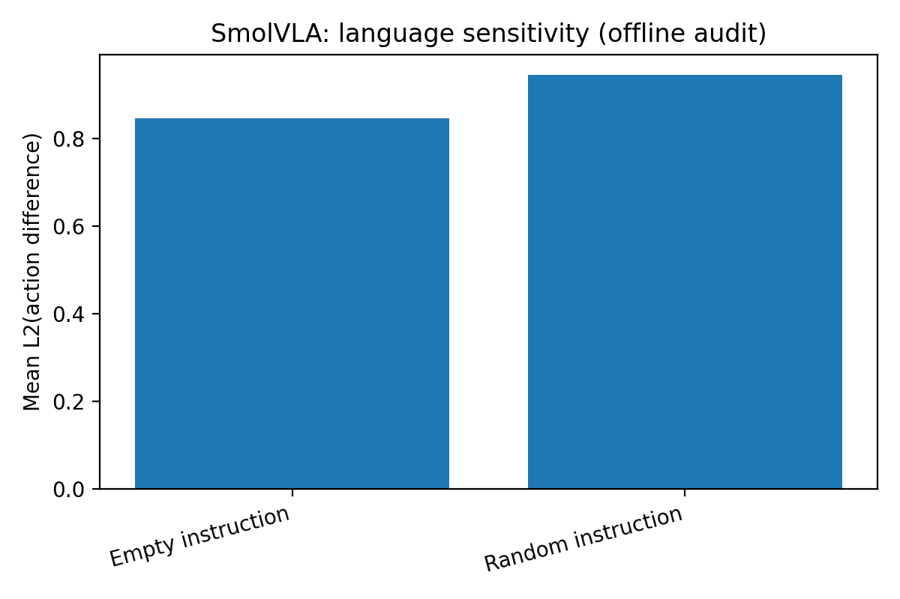

# VLA audit: SmolVLA × Smol-LIBERO (MacBook / MPS)

Я сделал небольшой, но воспроизводимый аудит публичной VLA‑политики для манипуляции: насколько она  
 зависит от текста инструкции и насколько хрупкая к небольшим визуальным сдвигам .

Модель: HuggingFaceVLA/smolvla_libero  
Датасет (LeRobot v3.0): eunyoung927/smol-libero-v30  
Железо: MacBook (Apple MPS)

## Что здесь есть

- src/audit_smolvla/audit_language.py — чувствительность к языку: оригинальная инструкция vs пустая vs контрфактуальная
- src/audit_smolvla/audit_ood_multi.py — OOD по картинке один запуск - brightness / noise / occlusion
- src/audit_smolvla/plot_results.py — строит графики из JSON
- outputs/ — результаты в JSON
- figures/ — готовые графики для отчёта
- report/report.md — формулировка проблемы + гипотеза

## Деталь про методику

SmolVLA использует action chunking/внутренние очереди: повторные вызовы select_action() могут возвращать разные действия даже на одном и том же входе.  
Чтобы измерять именно эффект изменения входа - язык и картинка я:

- сбрасываю состояние политики перед каждым предсказанием
- фиксирую seed на фрейм, чтобы сравнения были детерминированными

Проверка -  в language‑аудите mean_dist_repeat ≈ 0.
## Графики



## Как воспроизвести 

```bash
conda activate smolvla
pip install -U pip
pip install "lerobot[smolvla]==0.4.3" matplotlib numpy tqdm pillow
pip install -e .

python -m audit_smolvla.audit_language --n_frames 120 --seed 0
python -m audit_smolvla.audit_ood_multi --n_frames 120 --seed 0
python -m audit_smolvla.plot_results
```
